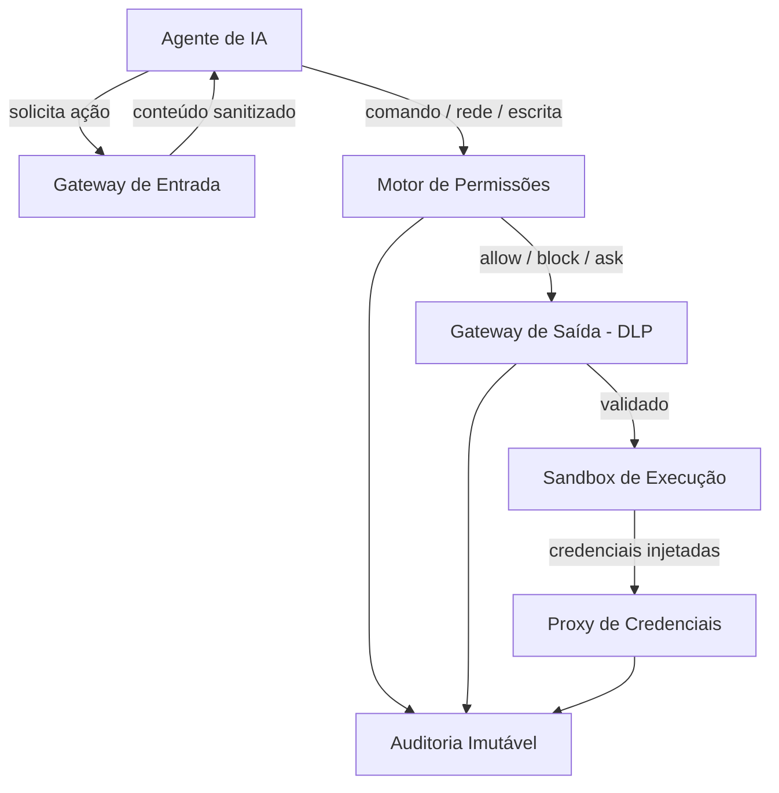

# Arquitetura — Ventura.SEG

## Visão Geral

Ventura.SEG é uma **camada de proteção** (não um agente isolado) que envolve qualquer agente de IA, interceptando, validando e registrando todo o tráfego de entrada e saída.



## Camadas

| Camada | Diretório | Status | Responsabilidade |
|--------|-----------|--------|------------------|
| Gateway de Entrada | `src/gateway_in/` | Scaffold | Sanitização de conteúdo externo |
| Motor de Permissões | `src/permissions/` | **Implementado** | Decisão allow/block/ask via YAML |
| Gateway de Saída | `src/gateway_out/` | Scaffold | DLP e validação de saída |
| Proxy de Credenciais | `src/credential_proxy/` | Scaffold | Segredos nunca expostos ao modelo |
| Sandbox | `src/sandbox/` | Scaffold | Isolamento real de execução |
| Auditoria | `src/audit/` | **Implementado** | Logs estruturados e imutáveis |

## Loop de Segurança

```
Observar → Detectar → Validar (multi-estágio) → Corrigir → Verificar → Aprender
```

## Hot-Reload

O Motor de Permissões suporta recarregamento dinâmico de políticas YAML em runtime:

```python
engine.reload()  # Recarrega do policy_dir original
engine.reload("/novo/caminho/policies")  # Ou de outro diretório
```

Em caso de erro no reload, as regras antigas são mantidas (fail-safe).

## Princípios de Design

1. **Fail-Secure** — na dúvida, bloqueia
2. **Segurança como Código** — todas as regras em YAML versionado
3. **Zero Trust** — nada é confiável por padrão
4. **Auditoria Total** — toda decisão é registrada
5. **Mínimo Overhead** — performance e baixo consumo de recursos
