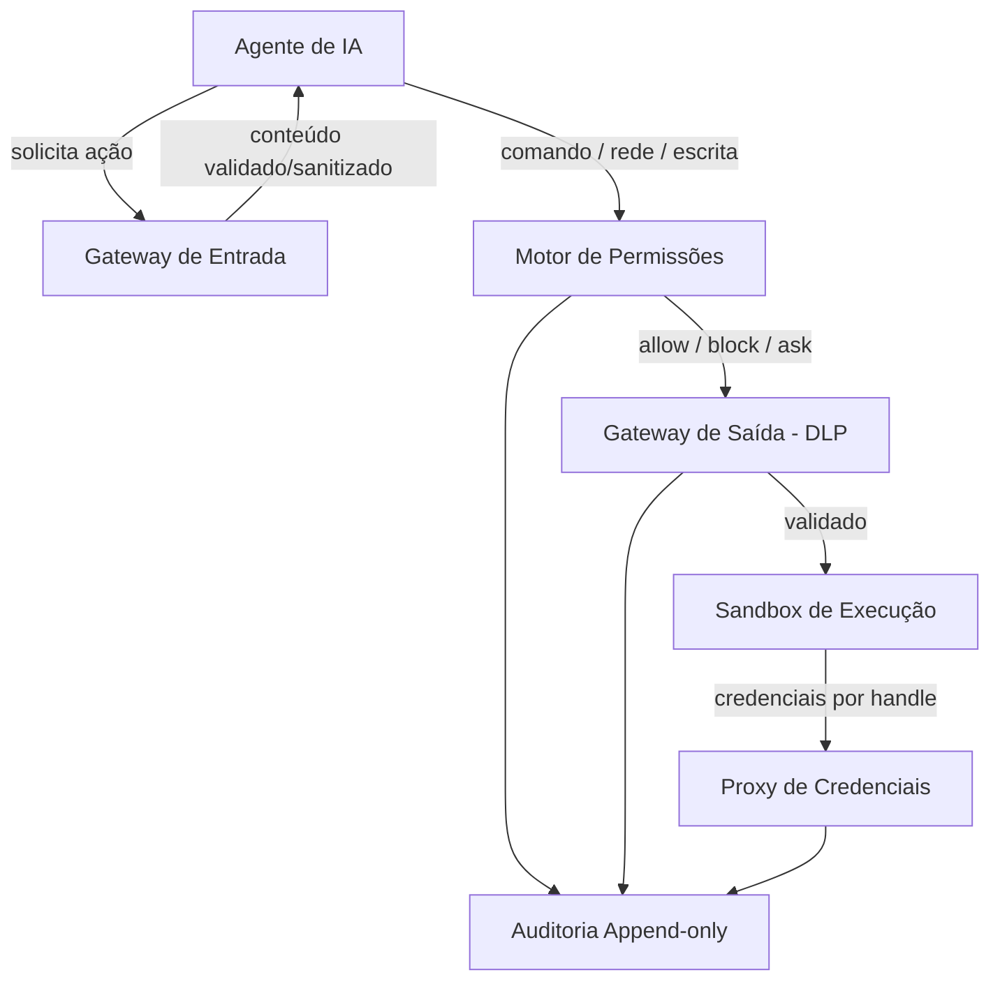

# Arquitetura — Ventura.SEG

## Visão Geral

Ventura.SEG é uma **camada de proteção** para agentes de IA que aplica controles de entrada, permissões, saída, credenciais, isolamento e auditoria. A arquitetura descreve os componentes existentes sem tratá-los como certificação ou garantia absoluta de segurança.



## Camadas

| Camada | Diretório | Status | Responsabilidade |
|--------|-----------|--------|------------------|
| Gateway de Entrada | `src/gateway_in/` | Baseline implementada | Sanitização e validação de conteúdo externo |
| Motor de Permissões | `src/permissions/` | Baseline implementada | Decisão allow/block/ask via políticas YAML |
| Gateway de Saída | `src/gateway_out/` | Baseline implementada | DLP e validação de saída |
| Proxy de Credenciais | `src/credential_proxy/` | Baseline implementada | Handles de segredos e integração opcional com Vault |
| Sandbox | `src/sandbox/` | Baseline implementada | Isolamento de execução conforme runtime disponível |
| Auditoria | `src/audit/` | Baseline implementada | Logs estruturados append-only |

"Baseline implementada" significa que há código e testes correspondentes no repositório. Não implica hardening completo, ausência de bypasses, certificação externa ou adequação automática a todos os ambientes de produção.

## Integridade de auditoria

O armazenamento atual é JSONL append-only durante a operação normal. Para garantias tamper-evident/tamper-resistant devem ser adicionados mecanismos como hash chain/HMAC/assinaturas, checkpoints e backend WORM ou equivalente.

## Loop de Segurança

```text
Observar → Detectar → Validar → Corrigir → Verificar → Aprender
```

## Hot-Reload

O Motor de Permissões suporta recarregamento de políticas YAML em runtime:

```python
engine.reload()
engine.reload("/novo/caminho/policies")
```

Em caso de erro no reload, as regras anteriores são mantidas.

## Princípios de Design

1. **Fail-Secure** — políticas críticas devem bloquear quando não puderem validar com segurança.
2. **Segurança como Código** — regras relevantes devem ser versionadas.
3. **Zero Trust** — confiança deve ser explícita e mínima.
4. **Auditoria** — decisões de segurança devem ser registradas.
5. **Eficiência Mensurável** — performance deve ser medida antes de qualquer claim de baixo overhead.
